# HustleHub+ — Part 1

HustleHub+ is a secure freelance marketplace. Freelancers advertise services. Clients browse and book those services. Bookings later create simulated payment records so freelancers can see income and estimated tax. Because the platform will hold passwords, identity, and money-related data, security is designed in from the first version, not added afterwards (The Independent Institute of Education, 2026; Open Worldwide Application Security Project, 2021).

Part 1 is the **secure backend foundation**: a Node.js and Express API for registration, login, and one JWT-protected route, served only over HTTPS.

**Demonstration video:** [HustleHub+ Part 1 demo](https://youtu.be/DcsFY8W7TBE) (Nordien, 2026).

---

## Table of contents

1. [Group members](#group-members)
2. [System and intended users](#system-and-intended-users)
3. [Architecture diagram explained for a non-technical reader](#architecture-diagram-explained-for-a-non-technical-reader)
4. [Backend structure](#backend-structure)
5. [How to run](#how-to-run)
6. [API endpoints](#api-endpoints)
7. [Request flow](#request-flow)
8. [Security decisions](#security-decisions)
9. [Testing, screenshots, and demonstration](#testing-screenshots-and-demonstration)
10. [Reference list](#reference-list)

---

## Group members

| Name | Student number | Role on Part 1 |
| --- | --- | --- |
| **Humera Mathia** (Group Leader) | ST10276384 | Node.js / Express API: folder layout, routes, controllers, models, file-based user storage, register / login / protected `/me`, HTTPS server, integration onto `main` |
| **Mohammed Ba Yazed** | ST10174227 | Password hashing (bcrypt), JWT sign/verify and secret handling, input validation (including unexpected fields) |
| **Lilitha Mlobi** | ST10454944 | MERN architecture diagram, security write-up, HTTPS setup documentation |
| **Imraan Nordien** | ST10434419 | Postman collection, API response screenshots, [demonstration video](https://youtu.be/DcsFY8W7TBE) |

---

## System and intended users

Imagine a digital marketplace, like a noticeboard plus a cash register. Three kinds of people will use it:

| Who | What they need from the system |
| --- | --- |
| **Client** | Find a service and book it |
| **Freelancer** | List a service, see bookings, later see income and tax |
| **Admin** | Look after the platform |

Part 1 does **not** yet build the website, gigs, or bookings. It only proves a more basic promise: a person can **create an account**, **log in**, and then prove “it is still me” on a later request, without sending the password again. The Independent Institute of Education (2026) requires that this first slice already use hashing, tokens, validation, and HTTPS, because credentials are already in play.

Sensitive data in this part is the **email and password** and the **user id and role**. Those never travel or sit in storage in a careless way.

Users are saved in a local file (`src/data/users.json`) so the API can run without installing MongoDB yet. The file is not committed to Git. Hashing and checks still happen **before** anything is written, so the same security layer can sit in front of MongoDB in Part 2 (MongoDB, Inc., 2024).

---

## Architecture diagram explained for a non-technical reader

If you have never built software, treat the picture below as a **three-storey building**. A customer does not walk into the basement filing room. They enter the shop (the website), speak to reception (the API), and only reception is allowed to open the cabinets (storage). That three-storey idea is what industry calls a **tiered** or **MERN** layout.

**MERN** is four tools that fit those storeys (MongoDB, Inc., 2024; OpenJS Foundation, n.d.; Meta Platforms, 2024; OpenJS Foundation, 2024):

| Letter | Tool | Plain English | Where it sits on the diagram |
| --- | --- | --- | --- |
| **M** | MongoDB | A professional database for users, gigs, and bookings | Orange **Data tier** at the bottom |
| **E** | Express | A rulebook: “if someone asks for this address, do this job” | Inside the blue **Server tier** |
| **R** | React | The clickable website in the browser | Green **Client tier** at the top |
| **N** | Node.js | The engine that runs the server | The same blue **Server tier** |

**Figure 1:** HustleHub+ architecture, security features, and system boundaries (authors’ own diagram, 2026).


### Storey 1 — green box: Client tier (React SPA)

This is the **shop window**: the HustleHub+ screen a person would open in Chrome or Edge. “SPA” means single-page application: the page does not fully reload for every click (Meta Platforms, 2024).

**Part 1 status:** this website is **not built yet**. We stand at the same door using **Postman**, a tool that sends the same kind of messages a React app will send later.

**Boundary:** the browser (or Postman) may only talk to the server over **HTTPS**. It must never keep a raw password. After login it may keep a **JWT** — think of a signed, time-limited visitor badge — not the password itself (Jones, Bradley and Sakimura, 2015).

### The arrow between green and blue — HTTPS (TLS)

The arrow labelled **HTTPS (TLS)** is a **locked tunnel** between the shop window and reception. TLS is the lock on that tunnel (Rescorla, 2018). That is why every address starts with `https://localhost:3000`, not `http://`.

Without this arrow, someone on the same Wi-Fi could read a password on login or a token on later requests. Hashing and JWT signing would then be pointless, because the secret would already have been stolen in transit (Rescorla, 2018; Open Worldwide Application Security Project, 2021).

The browser may show “Not secure” for our **self-signed** local certificate. That warning means the computer does not recognise our homemade stamp; the traffic is still encrypted. Postman should use HTTPS and turn SSL certificate verification off for this local stamp.

### Storey 2 — blue box: Server tier (Node.js + Express)

This is **reception**. It is the only part of the building the public is allowed to speak to. The diagram marks this as the **system boundary: reachable only over HTTPS**. Nobody on the internet is allowed to open the user file or, later, MongoDB. They must go through this box (OpenJS Foundation, n.d.; OpenJS Foundation, 2024).

Inside reception the diagram shows three purple desks. A message is handled **in order**:

1. **HTTPS** — the tunnel is opened and the body can be read safely.
2. **Validation** — is the form complete and legal?
3. **Auth & JWT** — if this is a private room, is the visitor badge valid?
4. **Routes & controllers** — do the actual job (register, login, or “who am I?”).
5. **Queries** — ask the filing cabinet to save or find a user.

#### Purple desk: Auth & JWT

On **register**, the password is **hashed** (turned into a one-way scramble) before it is stored (Provos and Mazières, 1999). On **login**, the scramble is compared and the server **issues a token** that carries only `id` and `role` (Jones, Bradley and Sakimura, 2015). On later calls such as `/me`, the same desk checks that badge. If the badge is missing, fake, or expired, the door stays closed.

#### Purple desk: Validation

This desk reads the form **before** any filing happens. Missing name, weak password, bad email, or a role such as `"manager"` is stopped here. Extra unexpected fields are thrown away so nobody can smuggle extra data into storage. Checking at the door means a later piece of code cannot “forget” to check (Open Worldwide Application Security Project, 2021).

#### Purple desk: Routes & controllers

These are the jobs reception is willing to do. The diagram mentions register, login, gigs, and bookings because that is the **full** marketplace. In Part 1 the jobs that exist are:

- register a user
- log in and receive a token
- `/me` — “show me who this badge belongs to”

Gigs and bookings are drawn as future work so the diagram still matches the MERN plan in the brief (The Independent Institute of Education, 2026).

### Storey 3 — orange box: Data tier

This is the **filing cabinet**. The arrow labelled **Queries** is reception asking: “save this user” or “find this email”.

**Part 1:** the cabinet is a file (`users.json`), which the brief allows instead of a live database (The Independent Institute of Education, 2026).  
**Later:** the same cabinet becomes **MongoDB**, the “M” in MERN (MongoDB, Inc., 2024). The green shop and blue reception stay; only this floor is swapped.

The cabinet **never** sees a plaintext password. It only ever stores a bcrypt hash.

### System boundaries (who may touch what)

A **boundary** is a fence. If you ignore the fence, you have no security, only hope.

| Actor | May talk to | Must not talk to |
| --- | --- | --- |
| Browser / Postman (client) | Server, and only over HTTPS | The user file or MongoDB |
| Server (Node + Express) | Client (answers) and storage (queries) | The internet except through HTTPS |
| Storage (file now, MongoDB later) | Server only | The public internet |

**Public rooms** (health, register, login): anyone may knock; they still pass HTTPS and validation.  
**Private rooms** (`/me`, and later gigs or bookings): every knock must show a valid JWT. That is the line on the diagram between “anyone can ask” and “only people with a badge get in”.

---

## Backend structure

```text
hustlehub-plus/
├── Architecture Diagram .png
├── README.md
├── .env.example
├── .gitignore
├── package.json
├── certs/                         # local SSL files (not committed)
├── postman/
│   ├── HustleHub-Part1.postman_collection.json
│   └── screenshots/               # 12 Postman images below
├── scripts/
│   └── generate-certs.js
└── src/
    ├── server.js                  # HTTPS only
    ├── app.js
    ├── config/
    ├── routes/
    ├── controllers/
    ├── models/
    ├── middleware/
    ├── utils/
    └── data/                      # users.json at runtime, gitignored
```

Routes only map addresses. Middleware enforces security before a controller runs. Utils hold hashing and JWT. Models own storage. That split is itself a boundary: validation cannot be skipped by hiding logic in one large file (The Independent Institute of Education, 2026).

---

## How to run

```bash
npm install
copy .env.example .env
npm run certs
npm run dev
```

On macOS or Linux use `cp .env.example .env`.

1. Set a long random `JWT_SECRET` in `.env`. Never commit `.env`.
2. `npm run certs` creates `certs/key.pem` and `certs/cert.pem` (gitignored).
3. The API listens on **`https://localhost:3000`**.

Health check: `GET https://localhost:3000/api/health`

---

## API endpoints

Base URL: `https://localhost:3000`

| Method | Path | Access | Success |
| --- | --- | --- | --- |
| `GET` | `/api/health` | Public | `200` |
| `POST` | `/api/auth/register` | Public | `201` |
| `POST` | `/api/auth/login` | Public | `200` |
| `GET` | `/api/auth/me` | Bearer JWT | `200` |

Roles: `client` \| `freelancer` \| `admin`

**Success:** `{ "success": true, "message": "...", "data": {} }`  
**Error:** `{ "success": false, "message": "..." }`  
Passwords are never returned in `data`.

### Register

`POST /api/auth/register`

```json
{
  "name": "Ada Lovelace",
  "email": "ada@test.com",
  "password": "Secret123!",
  "role": "client"
}
```

Password must be 8–128 characters and include uppercase, lowercase, a number, and a special character (Grassi, Garcia and Fenton, 2017).

| Case | Status |
| --- | --- |
| Missing or invalid fields | `400` |
| Weak password | `400` |
| Invalid role | `400` |
| Duplicate email | `409` |

### Login

`POST /api/auth/login`

```json
{
  "email": "ada@test.com",
  "password": "Secret123!"
}
```

| Case | Status |
| --- | --- |
| Missing fields | `400` |
| Unknown email or wrong password | `401` (same message for both) |

`data` includes `token` and `user`.

### Current user (protected)

`GET /api/auth/me`  
Header: `Authorization: Bearer <token>`

This is the Part 1 route **beyond login**. The JWT is validated on **every** call (The Independent Institute of Education, 2026; Jones, Bradley and Sakimura, 2015).

| Case | Status |
| --- | --- |
| No token | `401` |
| Invalid or expired token | `401` |

---

## Request flow

**Register:** HTTPS → `validateRegister` → duplicate-email check → `hashPassword` → `createUser` → `201` without password.

**Login:** HTTPS → `validateLogin` → find user → `comparePassword` → `signToken({ id, role })` → `200` with token.

**Protected `/me`:** HTTPS → `authMiddleware` reads `Bearer` → `verifyToken` → `findById` → `200` without password.

Failures return controlled JSON. Stack traces, file paths, and configuration values are not sent (Open Worldwide Application Security Project, 2021).

---

## Security decisions

The brief asks not only **what** was used, but **why** (The Independent Institute of Education, 2026).

### Password hashing

**What:** Passwords are hashed with **bcryptjs, 12 salt rounds** before save. Login uses `bcrypt.compare`. Plaintext is never stored or returned (Provos and Mazières, 1999).

**Why:** If `users.json` leaks, a slow salted hash is expensive to reverse. Rainbow tables fail because each password gets its own salt. A fast hash (MD5, SHA-1) or plaintext would turn one stolen file into a full takeover (Provos and Mazières, 1999; Open Worldwide Application Security Project, 2021). Twelve rounds is slow enough for attackers and still acceptable for register and login. Hashing happens **before** the model writes the file.

### Token-based authentication (JWT)

**What:** Login returns a JWT signed with `JWT_SECRET` from `.env`. The payload is only `id` and `role`. Protected routes send `Authorization: Bearer <token>`. `authMiddleware` verifies the token on **every** protected request (Jones, Bradley and Sakimura, 2015).

**Why:** The API stays **stateless**: the server does not keep a session table. Signing means a client cannot change `id` or `role` without breaking the signature. A small payload limits what is exposed if a token is stolen. The secret is not in GitHub. Checking every time stops `/me` from being called with a missing, expired, or forged token.

### Input validation

**What:** `validateRegister` and `validateLogin` run before controllers. They require the right fields, a real email, a strong password, an allowed role, and they reject unexpected fields.

**Why:** The API is the first place an attacker can send data. One door policy means a controller cannot skip checks (Open Worldwide Application Security Project, 2021). A weak password is refused because hashing a guessable password still leaves the account easy to break (Grassi, Garcia and Fenton, 2017). Login uses one message, `"Invalid email or password"`, so the API does not confirm whether an email is registered.

### HTTPS

**What:** `src/server.js` always uses `https.createServer` with a local certificate. There is no HTTP fallback.

**Why:** Hashing and JWT do not help if the password or token crosses the network in clear text (Rescorla, 2018). Serving HTTPS in development also finds certificate mistakes now, not only in production.

### Controlled error handling

**What:** Unexpected errors return `{ success: false, message: "Something went wrong" }`. Unknown URLs return JSON `404`.

**Why:** Raw errors can leak stack traces, paths, or configuration and help an attacker map the server (Open Worldwide Application Security Project, 2021).

---

## Testing, screenshots, and demonstration

Imraan Nordien (ST10434419) produced the Postman collection (`postman/HustleHub-Part1.postman_collection.json`), the twelve screenshots below, and the demonstration video.

**Demonstration video:** [https://youtu.be/DcsFY8W7TBE](https://youtu.be/DcsFY8W7TBE) (Nordien, 2026). The recording shows the API running over HTTPS, successful registration, and login with token generation, as required by The Independent Institute of Education (2026).

### 1. Health — API is running (`200`)

`GET /api/health` proves the server is up over HTTPS.

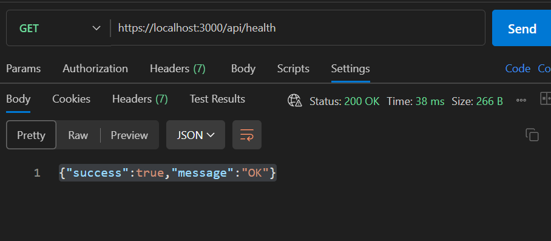

### 2. Register — success (`201`)

A valid body creates a user. The password is not returned.

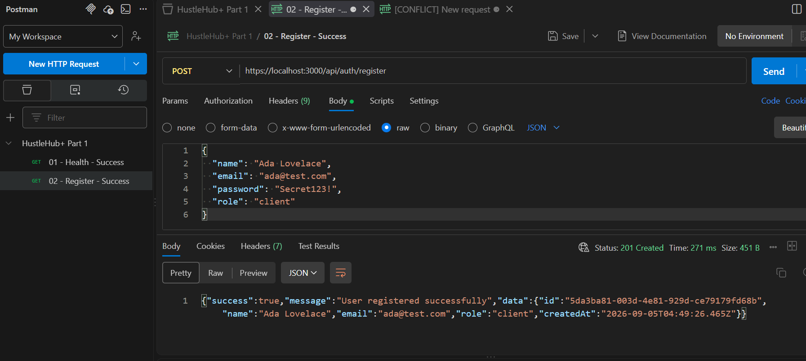

### 3. Register — missing fields (`400`)

Name is omitted. Validation rejects the request before storage.

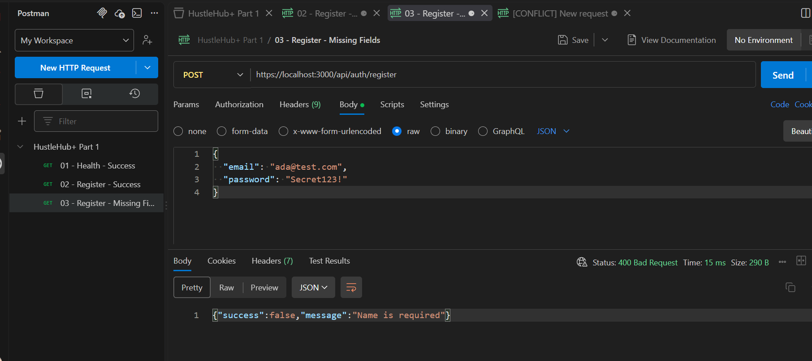

### 4. Register — weak password (`400`)

`secret123` has no uppercase letter (Grassi, Garcia and Fenton, 2017).

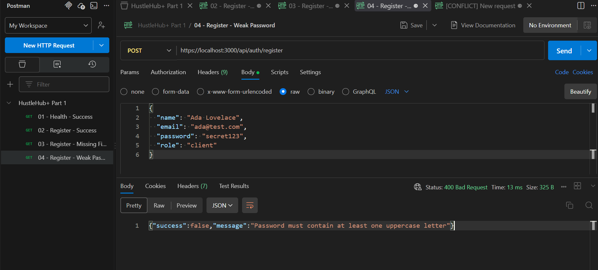

### 5. Register — invalid role (`400`)

`"manager"` is not allowed. Only `client`, `freelancer`, or `admin`.

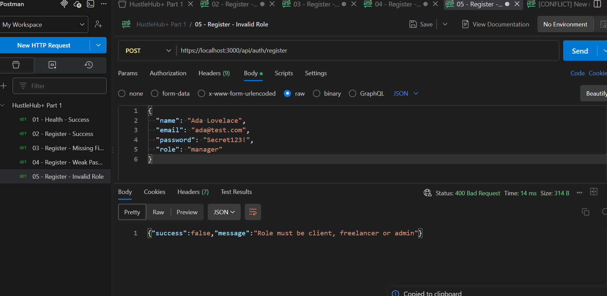

### 6. Register — duplicate email (`409`)

The same email cannot register twice.

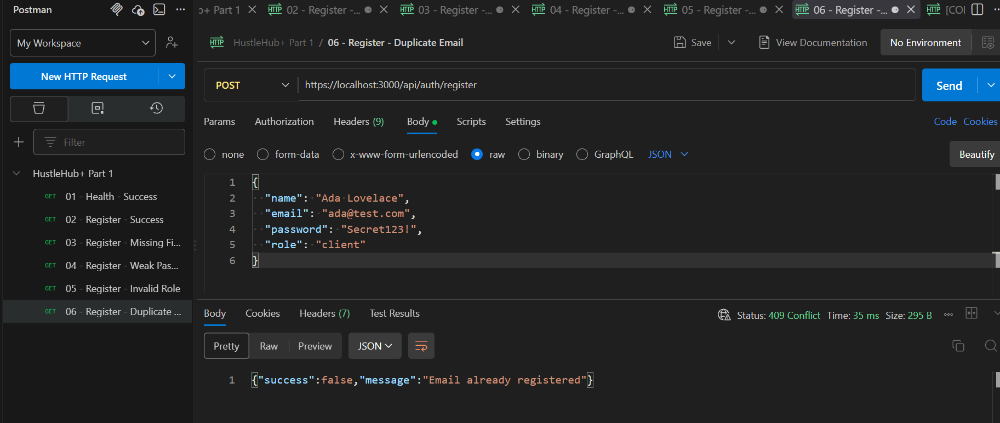

### 7. Login — success and JWT (`200`)

Correct credentials return a token (Jones, Bradley and Sakimura, 2015).

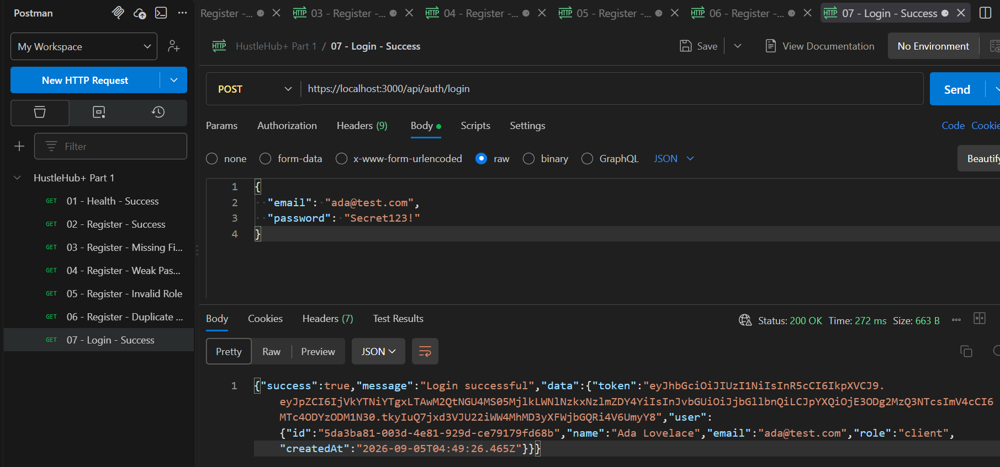

### 8. Login — missing fields (`400`)

Password omitted. Validation runs before login logic.

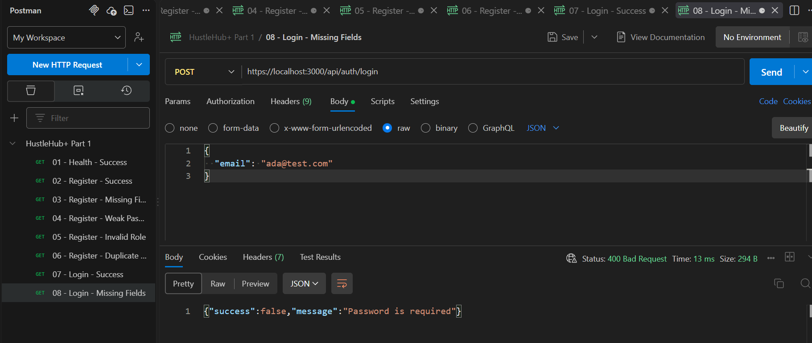

### 9. Login — invalid credentials (`401`)

Wrong password. The message does not reveal whether the email exists.

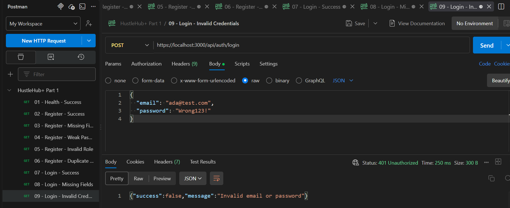

### 10. Protected `/me` — no token (`401`)

The route beyond login refuses callers with no JWT.

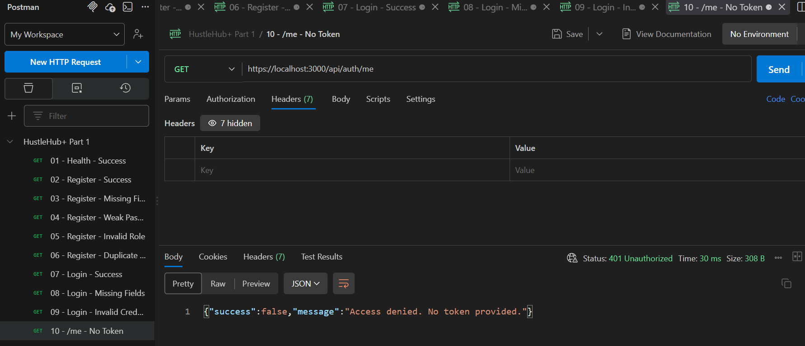

### 11. Protected `/me` — invalid token (`401`)

`Bearer badtoken` is rejected. The token is checked on every protected request.

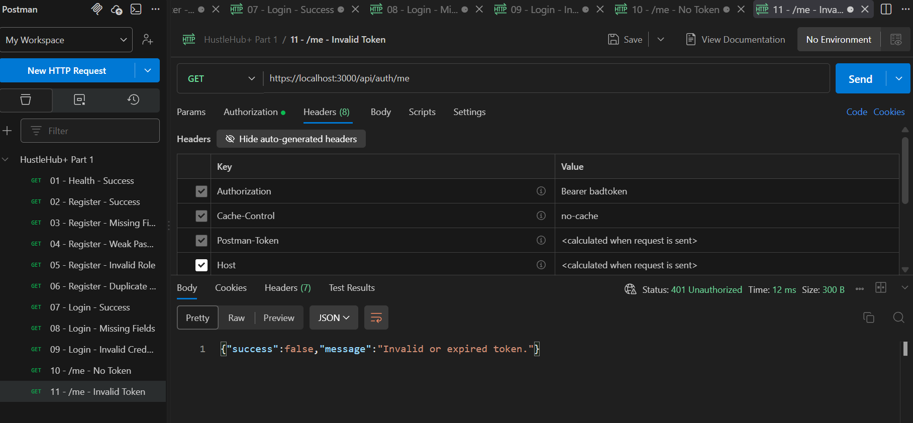

### 12. Protected `/me` — valid token (`200`)

The login token identifies the user. The password is still not returned.

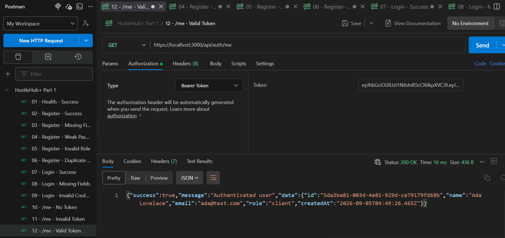

---

## Reference list

Grassi, P.A., Garcia, M.E. and Fenton, J.L., 2017. *Digital identity guidelines: authentication and lifecycle management*. NIST Special Publication 800-63B. [online] Gaithersburg: National Institute of Standards and Technology. Available at: <https://doi.org/10.6028/NIST.SP.800-63B> [Accessed 6 September 2026].

Jones, M., Bradley, J. and Sakimura, N., 2015. *JSON web token (JWT)*. RFC 7519. [online] Internet Engineering Task Force. Available at: <https://www.rfc-editor.org/rfc/rfc7519> [Accessed 6 September 2026].

Meta Platforms, 2024. *React*. [online] Available at: <https://react.dev/> [Accessed 6 September 2026].

MongoDB, Inc., 2024. *Introduction to MongoDB*. [online] Available at: <https://www.mongodb.com/docs/manual/introduction/> [Accessed 6 September 2026].

Nordien, I., 2026. *HustleHub+ Part 1 demonstration*. [video online] Available at: <https://youtu.be/DcsFY8W7TBE> [Accessed 6 September 2026].

OpenJS Foundation, 2024. *Node.js documentation*. [online] Available at: <https://nodejs.org/docs/latest/api/> [Accessed 6 September 2026].

OpenJS Foundation, n.d. *Express — fast, unopinionated, minimalist web framework for Node.js*. [online] Available at: <https://expressjs.com/> [Accessed 6 September 2026].

Open Worldwide Application Security Project, 2021. *OWASP top 10:2021*. [online] Available at: <https://owasp.org/Top10/2021/> [Accessed 6 September 2026].

Provos, N. and Mazières, D., 1999. A future-adaptable password scheme. *Proceedings of the FREENIX Track: 1999 USENIX Annual Technical Conference*. Monterey, United States of America, 6–11 June 1999. Berkeley: USENIX Association. Available at: <https://www.usenix.org/legacy/events/usenix99/provos.html> [Accessed 6 September 2026].

Rescorla, E., 2018. *The transport layer security (TLS) protocol version 1.3*. RFC 8446. [online] Internet Engineering Task Force. Available at: <https://www.rfc-editor.org/rfc/rfc8446> [Accessed 6 September 2026].

The Independent Institute of Education, 2026. *Information systems 3D / Application development security: POE (paper and marking rubric)*. [pdf] [s.l.]: The Independent Institute of Education.
